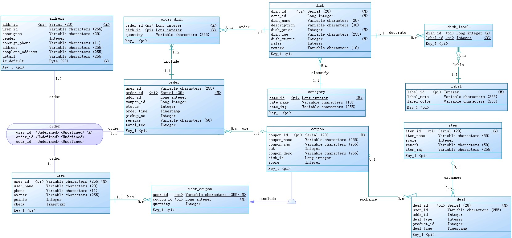

# 蟹堡王点餐小程序
本项目为作者的数据库课设，旨在模仿麦当劳小程序打造一个以蟹堡王为主题的简易版在线点餐系统。

由于时间匆忙，代码规范和项目结构可能有点乱，页面逻辑、功能、性能等待完善，望谅解。

如果觉得对你有帮助的话，能给个star就太好了

## 技术选型

后端：SpringBoot + MyBatis + JWT + MySQL + Redis

前端：Vue + element UI（小程序端采用uniapp框架，后台管理为网页端）

本来要加Redis作数据缓存的，时间太赶了，弃之，只用来存了验证码

## 项目演示

食物图片资源来自麦当劳官网

演示录像文件见assets文件夹

* 小程序端真机调试（域名备案太麻烦了，上线难绷）


* 后台管理页面


## 数据库设计

ER图



### address

| 字段名           | 描述           |
| ---------------- | -------------- |
| addr_id          | bigint(20)     |
| user_id          | varchar(255)   |
| consignee        | 收货人         |
| gender           | 性别           |
| consign_phone    | 收货人电话     |
| address          | 收货地址       |
| complete_address | 完整地址       |
| detail           | 详细地址       |
| is_default       | 是否为默认地址 |

### admin

| 字段名   | 描述         |
| -------- | ------------ |
| username | varchar(255) |
| password | varchar(255) |

### user

| 字段名    | 描述         |
| --------- | ------------ |
| user_id   | varchar(255) |
| user_name | varchar(20)  |
| phone     | varchar(11)  |
| avatar    | 用户头像     |
| points    | 积分         |
| check     | 签到日期     |

### coupon

| 字段名      | 描述             |
| ----------- | ---------------- |
| coupon_id   | bigint(20)       |
| coupon_name | 优惠券名称       |
| coupon_img  | varchar(255)     |
| cut         | 优惠券额度       |
| coupon_desc | 优惠券介绍       |
| dish_id     | 优惠券对应的菜品 |
| score       | 优惠券所需积分   |

### user_coupon

用于存储用户拥有的优惠券

| 字段名    | 描述         |
| --------- | ------------ |
| user_id   | varchar(255) |
| coupon_id | bigint(20)   |
| quantity  | int(11)      |

### category

| 字段名    | 描述         |
| --------- | ------------ |
| cate_id   | bigint(20)   |
| cate_name | 菜品类别     |
| cate_img  | varchar(255) |

### dish

| 字段名      | 描述           |
| ----------- | -------------- |
| dish_id     | bigint(20)     |
| cate_id     | 菜品对应的类别 |
| dish_name   | 菜名           |
| description | 简介           |
| dish_price  | 价格           |
| dish_img    | varchar(255)   |
| dish_status | 出售/停售      |
| sales       | 销量           |
| remark      | 排名等级       |

### label

| 字段名      | 描述     |
| ----------- | -------- |
| label_id    | int(11)  |
| label_name  | 标签名   |
| label_color | 标签颜色 |

### dish_label

用于关联`dish`表和`label`表

| 字段名   | 描述       |
| -------- | ---------- |
| dish_id  | bigint(20) |
| label_id | int(11)    |

### item

| 字段名    | 描述         |
| --------- | ------------ |
| item_id   | bigint(20)   |
| item_name | varchar(50)  |
| score     | int(11)      |
| remark    | varchar(50)  |
| item_img  | varchar(255) |

### order

| 字段名     | 描述                          |
| ---------- | ----------------------------- |
| user_id    | varchar(255)                  |
| order_id   | bigint(20)                    |
| addr_id    | 为0表示堂食/自提，非0表示外卖 |
| coupon_id  | 为0表示未使用优惠券           |
| status     | int(11)                       |
| order_time | 下单时间                      |
| pickup_no  | 取餐号                        |
| remarks    | 备注                          |
| total_fee  | 总价格（扣除优惠券额度后）    |

### order_dish

用于存储每个订单点的菜及数量

| 字段名   | 描述         |
| -------- | ------------ |
| order_id | bigint(20)   |
| dish_id  | bigint(20)   |
| quantity | varchar(255) |

### deal

积分商城兑换记录，在积分商城可通过积分兑换优惠券（coupon）或周边产品（item）

coupon的`addr_id`为0，item的`addr_id`不为0

| 字段名     | 描述               |
| ---------- | ------------------ |
| deal_id    | bigint(20)         |
| user_id    | varchar(255)       |
| addr_id    | bigint(11)         |
| deal_type  | 购买类型           |
| product_id | coupon_id或item_id |
| deal_time  | 兑换时间           |

## SQL语句

除基本的CURD，挑几个相对复杂的出来讲讲

后端设置了一个定时任务，每三小时执行一次

* 定时更新产品销量

```sql
UPDATE dish d
JOIN (
    SELECT od.dish_id, SUM(od.quantity) as total_quantity
    FROM `order` o
    JOIN order_dish od ON o.order_id = od.order_id
    WHERE o.order_time >= DATE_SUB(NOW(), INTERVAL 3 HOUR)
    GROUP BY od.dish_id
) q ON d.dish_id = q.dish_id
SET d.sales = d.sales + q.total_quantity;
```

查询三小时内的订单，汇总不同产品在此期间的销售数量，更新`dish`表的`sales`字段

1. 在`order`表寻找`order_time`晚于三小时前的时刻的`order_id`
2. 在`order_dish`表寻找对应`order_id`的记录
3. 聚合统计`quantity`，更新`dish`表

* 定时更新产品排名

```sql
UPDATE dish d
    JOIN (
    SELECT dish_id, NTILE(10) OVER (ORDER BY sales) AS `ntile`
    FROM dish
    ) q ON d.dish_id = q.dish_id
    SET d.remark = CASE
        WHEN q.ntile >= 9 THEN '爆中爆款'
        WHEN q.ntile >= 5 THEN '小有名气'
        WHEN q.ntile <= 1 THEN '小众冷门'
        ELSE '凡人榜'
END;
```

`NTILE`是`MySQL8.0.2`新增的窗口函数，用于将行划分为特定数量的组，

`NTILE(10)`表示将记录划分为10个组，按`sales`降序排列

对不同范围的组号进行产品排名给予

即前10%、前50%-10%、后10%、后10%-50%，分为四等

* 用户每日签到

```sql
UPDATE `user`
SET `check` = NOW(), `points` = `points` + 1
WHERE `user_id` = <@p name="userId"/> AND DATE(`check`) <> CURDATE();
```

判断用户的`check`不为当日，`points`加一，更新`check`为当前时间

* 更新订单费用

```sql
UPDATE `order`
SET total_fee = (SELECT ((SELECT SUM(d.dish_price * od.quantity)
                 FROM dish d
                          JOIN order_dish od ON d.dish_id = od.dish_id
                 WHERE d.dish_id IN
  <#list dishes as d>
  <#if d_index == 0>
  (
  </#if>
    ${d.dish.dishId}
  <#if d_has_next>
  ,
  <#else>
    )
  </#if>
  </#list>
    AND od.order_id = <@p name="orderId"/>) - IFNULL((
        SELECT c.cut
        FROM `coupon` c, `user_coupon` uc
        WHERE uc.coupon_id = <@p name="couponId"/> AND uc.user_id = <@p name="userId"/> AND uc.coupon_id = c.coupon_id
    ),0)))
WHERE order_id = <@p name="orderId"/>;

UPDATE `user_coupon`
SET `quantity` = `quantity` - 1
WHERE `coupon_id` = <@p name="couponId"/> AND user_id = <@p name="userId"/>;

DELETE FROM `user_coupon`
WHERE `quantity` = 0 AND user_id = <@p name="userId"/>;
```

订单的总费用需要查询多个表，总量*单价 - 优惠券额度，一单最多使用一张优惠券

1. 从`user_coupon`表中查询`coupon_id`，再到`coupon`查找对应`coupon_id`的优惠券额度`cut`，若`coupon_id`为空或不存在返回0
2. `order_dish`查询`order_id`对应的`dish_id`及`quantity`，再拿着`dish_id`去`dish`表找`dish_price`
3. 更新`user_coupon`，优惠券数量减一
4. 删除`user_coupon`中优惠券数量为0的记录

* 商品购买

```sql
UPDATE user
SET points = points -
    <#if productType == 0>
        (SELECT score
            FROM coupon
            WHERE coupon_id = <@p name="productId"/>)
    <#else>
        (SELECT score
            FROM item
            WHERE item_id = <@p name="productId"/>)
    </#if>
WHERE user_id = <@p name="userId"/>;

INSERT INTO `deal` (
    deal_id,
    user_id,
    addr_id,
    deal_type,
    product_id,
    deal_time
) VALUES (
    null,
    <@p name="userId"/>,
    <@p name="addrId"/>,
    <@p name="productType"/>,
    <@p name="productId"/>,
    NOW()
);

<#if productType == 0>
    IF EXISTS (SELECT * FROM user_coupon WHERE user_id = <@p name="userId"/> AND coupon_id = <@p name="productId"/>)
        UPDATE user_coupon SET quantity = quantity + 1 WHERE user_id = <@p name="userId"/> AND coupon_id = <@p name="productId"/>;
    ELSE
        INSERT INTO user_coupon (user_id, coupon_id, quantity) VALUES (<@p name="userId"/>, <@p name="productId"/>, 1);
</#if>
```

由于前端将优惠券和商品进行了统一，因此这里要对其分开处理

* 根据`productType`查询优惠券或商品所需积分

* 更新用户积分（在这之前有检验积分是否足够）
* `deal`表插入购买记录
* 若购买的是优惠券，若用户已拥有该优惠券，数量加1，否则插入新的记录

## 鸣谢

参考项目：

* 黑马瑞吉外卖后台管理
* [tinypuppet/heytea: uniapp仿喜茶GO小程序前端模板(weapp + H5)(github.com)](https://github.com/tinypuppet/heytea)
